# Planit - User Guide

**Version 1.0** | **Last Updated: February 2026**

Welcome to Planit, a professional Kanban board application for managing your projects and tasks efficiently. This guide will walk you through all the features and help you get started.

---

## 📋 Table of Contents

1. [Getting Started](#getting-started)
2. [Workspaces](#workspaces)
3. [Boards](#boards)
4. [Lists & Cards](#lists--cards)
5. [Advanced Features](#advanced-features)
6. [FAQ & Troubleshooting](#faq--troubleshooting)

---

## 🚀 Getting Started

### Accessing Planit

Planit is available at: **[https://planit-nine-psi.vercel.app](https://planit-nine-psi.vercel.app)**

### Creating Your Account

1. Navigate to the Planit homepage
2. Click on the **"Sign Up"** or **"Register"** button
3. Fill in the registration form:
   - **Username**: Choose a unique username (3-20 characters)
   - **Email**: Enter a valid email address
   - **Password**: Create a secure password (minimum 6 characters)
4. Click **"Register"** to create your account
5. You will be automatically logged in and redirected to your Dashboard

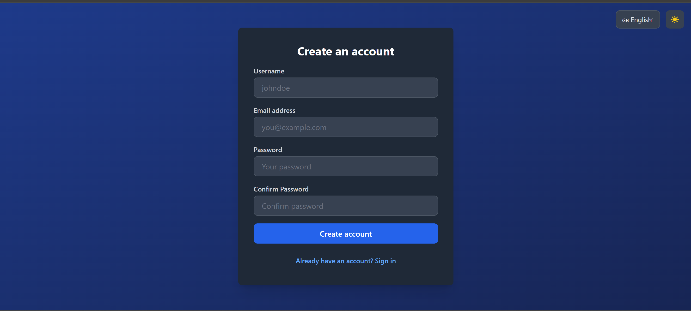
_Registration page showing the sign-up form_

### Logging In

1. Click **"Login"** on the homepage
2. Enter your **email** and **password**
3. Click **"Login"**
4. You'll be redirected to your Dashboard

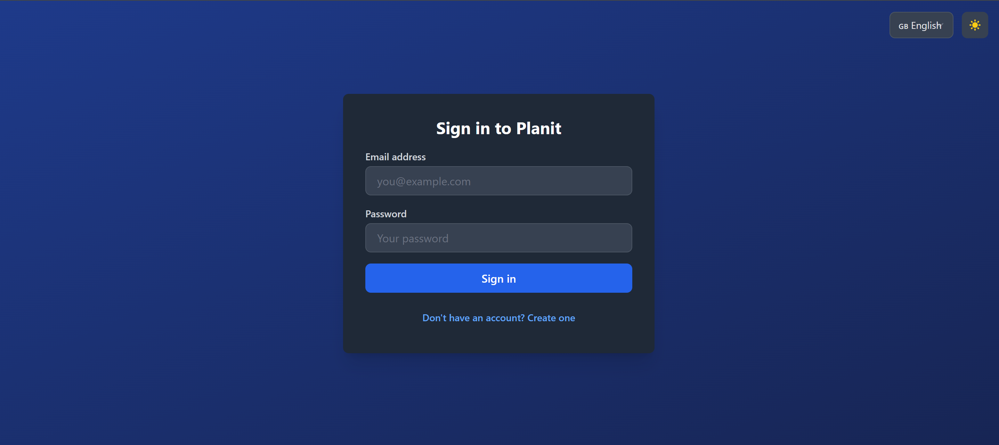
_Login form with email and password fields_

---

## 🗂️ Workspaces

Workspaces are the top-level containers for organizing your projects. Each workspace can contain multiple boards.

### Creating a Workspace

1. From your **Dashboard**, click the **"+ Create Workspace"** button
2. In the modal dialog, enter:
   - **Workspace Name**: Give your workspace a descriptive name (e.g., "Personal Projects", "Team Alpha")
   - **Description** (optional): Add details about the workspace purpose
3. Click **"Create"** to save your workspace

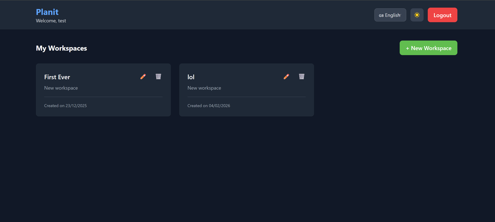
_Full dashboard view showing workspace cards and create button_

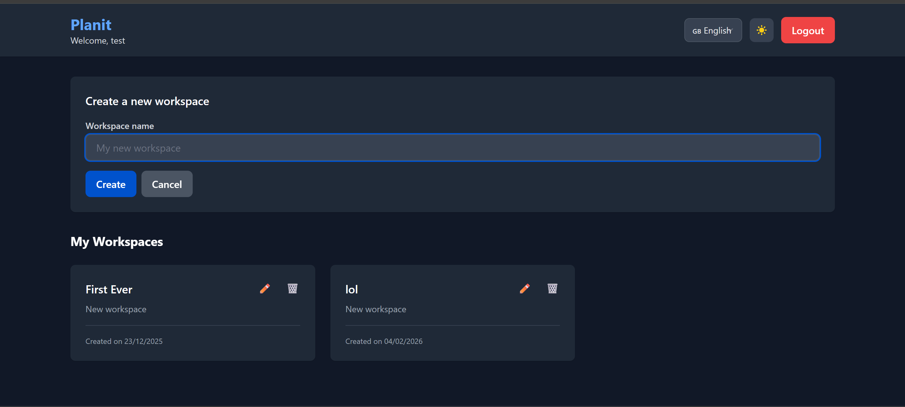
_Modal with name and description fields visible_

### Managing Workspaces

#### Viewing Workspaces

All your workspaces are displayed as cards on the Dashboard. Each card shows:

- Workspace name
- Description
- Creation date
- Quick action buttons (Edit, Delete)

#### Editing a Workspace

1. Locate the workspace card on your Dashboard
2. Click the **Edit (pencil)** icon
3. Update the name or description
4. Click **"Save"** to apply changes

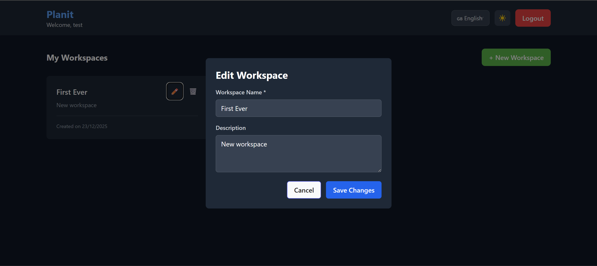
_Modal with pre-filled workspace data_

#### Deleting a Workspace

1. Click the **Delete (trash)** icon on the workspace card
2. Confirm the deletion in the dialog
3. **⚠️ Warning**: This will permanently delete all boards, lists, and cards within the workspace

---

## 📊 Boards

Boards represent individual projects within a workspace. Each board contains lists and cards to organize tasks.

### Creating a Board

1. Click on a **Workspace card** to open the workspace view
2. Click **"+ Create Board"**
3. Fill in the board details:
   - **Board Title**: Name your board (e.g., "Sprint 1", "Marketing Campaign")
   - **Description** (optional): Add context about the board
   - **Background Color** (optional): Choose a color to personalize your board
4. Click **"Create"**

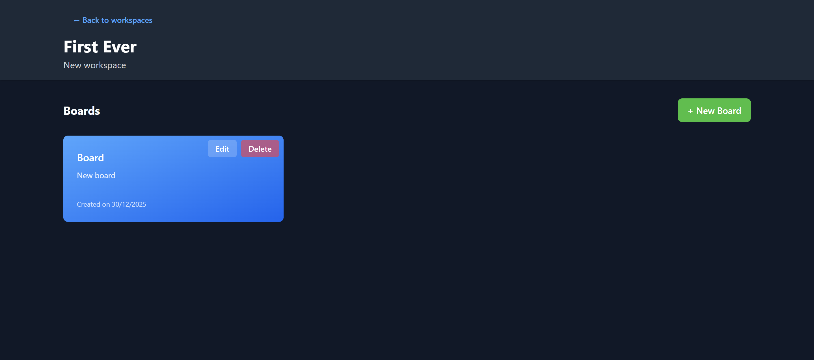
_Workspace view with board cards and create button_

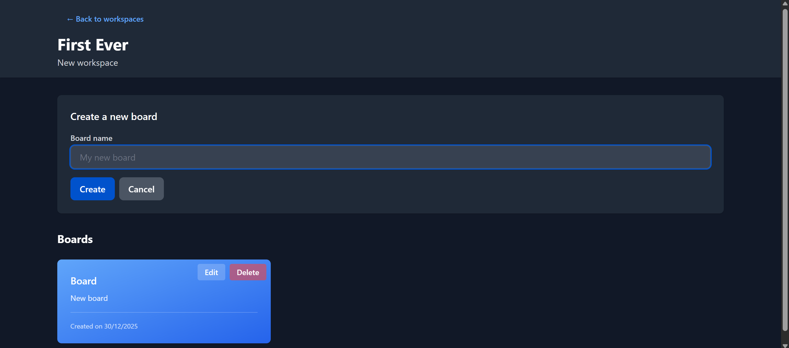
_Modal with title, description, and background color fields_

### Opening a Board

1. Click on any **Board card** to open the board view
2. The board displays all lists and cards in a Kanban layout

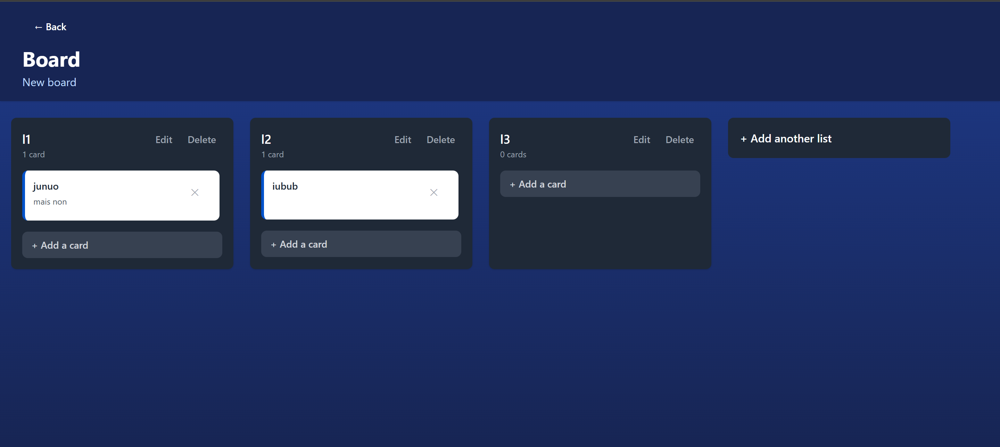
_Full board view showing multiple lists with cards_

### Managing Boards

#### Editing a Board

1. Open the board
2. Click the **Edit (pencil)** icon in the board header
3. Modify the title, description, or background
4. Click **"Save"**

#### Archiving a Board

1. Click the **Archive** button in the board settings
2. Archived boards can be restored later (feature in development)

#### Deleting a Board

1. Click the **Delete** icon
2. Confirm deletion
3. **⚠️ Warning**: All lists and cards will be permanently deleted

---

## 📝 Lists & Cards

### Creating Lists

Lists represent workflow stages (e.g., "To Do", "In Progress", "Done").

1. In the board view, click **"+ Add List"**
2. Enter a **List Title** (e.g., "Backlog", "Testing")
3. Press **Enter** or click **"Create"**

_"Add List" input area highlighted_

### Managing Lists

#### Editing a List

1. Click the **Edit (pencil)** icon on the list header
2. Update the list title
3. Click **"Save"**

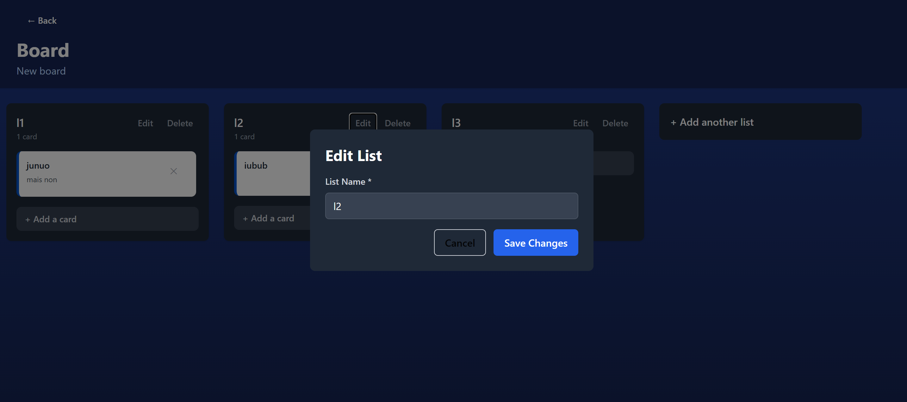
_Modal with list title field_

#### Reordering Lists (Drag & Drop)

1. Click and hold the **list header**
2. Drag the list to the desired position
3. Release to drop
4. **💾 Positions are automatically saved** and persist after page refresh

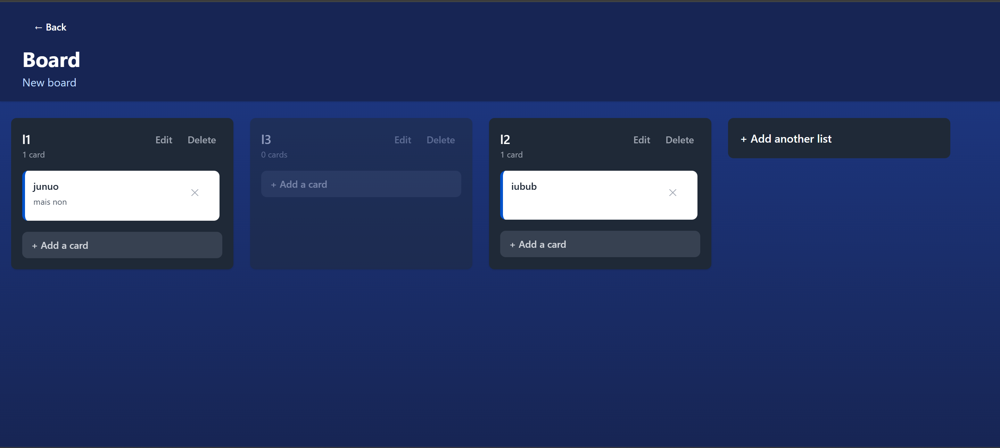
_Visual indication of a list being dragged between positions_

#### Deleting a List

1. Click the **Delete (trash)** icon on the list header
2. Confirm deletion
3. **⚠️ Warning**: All cards in the list will be deleted

---

### Creating Cards

Cards represent individual tasks or items.

1. In any list, click **"+ Add Card"**
2. Enter a **Card Title** (e.g., "Design landing page")
3. Press **Enter** or click **"Add"**

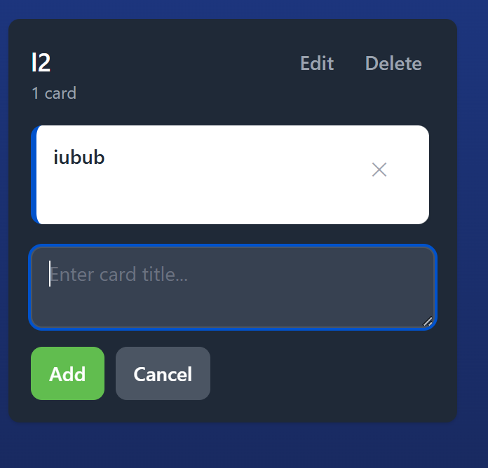
_"Add Card" input area at bottom of a list_

### Managing Cards

#### Viewing Card Details

1. Click on any **card** to open the card modal
2. View and edit:
   - **Title**: Card name
   - **Description**: Detailed information about the task

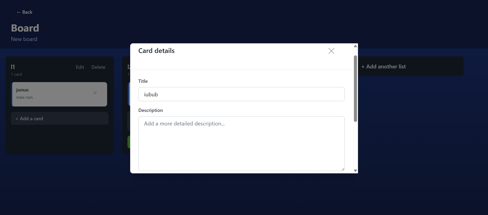
_Full card modal with title and description fields_

#### Editing a Card

1. Open the card modal
2. Click in the **Title** or **Description** fields
3. Make your changes
4. Click **"Save"** to update

#### Moving Cards (Drag & Drop)

**Within the same list (reordering):**

1. Click and hold a card
2. Drag it up or down within the list
3. Release to drop

**Between lists:**

1. Click and hold a card
2. Drag it to another list
3. Release to drop in the target list
4. **💾 Position and list changes are automatically saved**

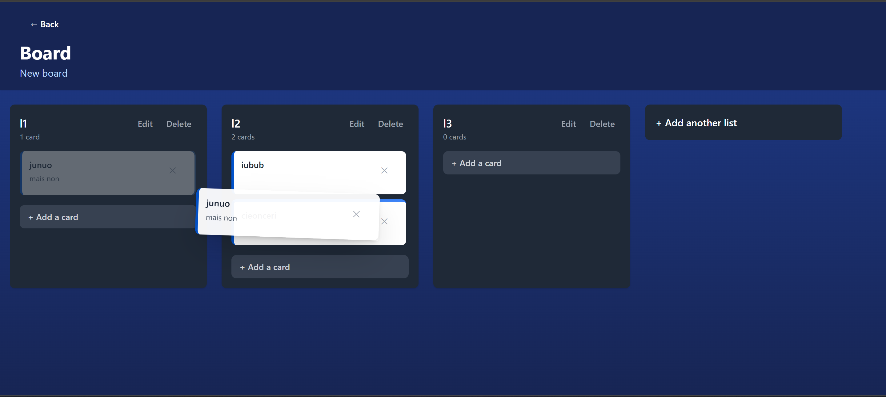
_Visual indication of a card being moved from one list to another_

#### Deleting a Card

1. Open the card modal
2. Click the **Delete** button
3. Confirm deletion

---

### 🏷️ Labels

Labels help you categorize and organize cards with color-coded tags.

#### Creating Labels

1. Open any **Board**
2. Click the **"🏷️ Manage Labels"** button in the board header
3. In the Label Manager modal:
   - Enter a **Label Name**
   - Choose a **Color** (e.g., blue, red, green, yellow)
   - Click **"Create"**

#### Assigning Labels to Cards

1. Open the **Card Modal**
2. In the labels section, click **"Add Label"**
3. Select labels from the dropdown
4. Selected labels appear as colored tags on the card

#### Removing Labels

1. Open the Card Modal
2. Click the **×** button on any label to remove it

---

### 👥 Workspace Members

Collaborate with team members by inviting them to your workspace.

#### Inviting Members

1. Open a **Workspace** (click on the workspace card)
2. Click the **"👥 Members"** or **"Invite Members"** button
3. In the invitation modal:
   - Enter the **email address** of the person you want to invite
   - Select their **role**:
     - **Owner**: Full control (manage members, delete workspace)
     - **Member**: Can view and edit boards (default)
   - Click **"Invite"**

#### Viewing Members

1. Open a Workspace
2. The member list shows:
   - Member name/email
   - Role (Owner/Member)
   - Join date

#### Removing Members

1. Open the Members list
2. Click **"Remove"** next to a member's name
3. Confirm removal
4. **Note**: Only workspace owners can remove members

#### Assigning Members to Cards

1. Open a **Card Modal**
2. In the assignees section, click **"Assign Member"**
3. Select members from the dropdown
4. Assigned members appear on the card
5. To unassign, click the **×** button next to their name

---

### 💬 Comments

Add comments to cards for discussions and notes.

#### Adding a Comment

1. Open the **Card Modal**
2. Scroll to the **Comments** section at the bottom
3. Type your comment in the text field
4. Click **"Add Comment"** or press **Enter**

#### Viewing Comments

- All comments appear in chronological order (oldest first)
- Each comment shows:
  - Author name
  - Comment text
  - Timestamp (e.g., "2 hours ago")

#### Deleting Comments

1. Locate your comment in the card modal
2. Click the **Delete** icon (trash bin)
3. Confirm deletion
4. **Note**: You can only delete your own comments

---

### 📅 Due Dates

Set deadlines for cards to track task priorities.

#### Setting a Due Date

1. Open the **Card Modal**
2. In the due date section, click **"Set Due Date"**
3. Use the date picker to select a date and time
4. Click **"Save"**

#### Due Date Indicators

- **Overdue**: Cards past their due date show a red indicator
- **Upcoming**: Cards due soon show a yellow indicator
- **On Time**: Cards with future due dates show a green indicator

#### Removing Due Dates

1. Open the Card Modal
2. Click the **×** button next to the due date
3. Confirm removal

#### Filtering by Due Date

1. In the Board view, use the filter options
2. Select **"Overdue"** to see cards past their due date
3. This helps prioritize urgent tasks

---

## ✨ Advanced Features

### 🌍 Internationalization (Language Support)

Planit supports **English (EN)** and **French (FR)** languages.

#### Changing Language

1. Look for the **Language Selector** in the navigation bar (top-right corner)
2. Click on the language dropdown
3. Select your preferred language:
   - 🇬🇧 **English**
   - 🇫🇷 **Français**
4. The entire interface will immediately update to the selected language

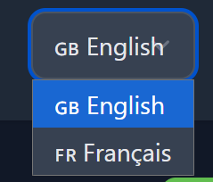
_Navigation bar with language dropdown expanded_

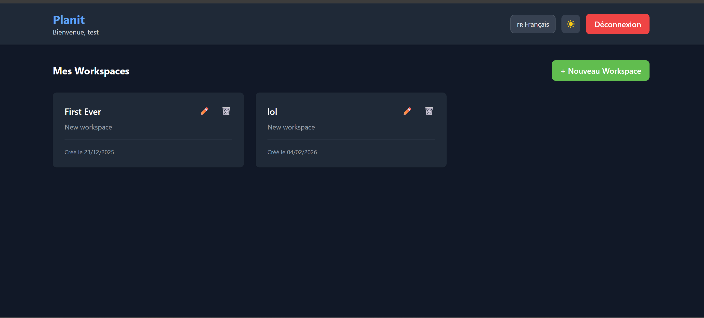
_Dashboard showing French translations ("Espaces de travail")_

---

### 🌙 Dark Mode

Planit includes a dark mode theme for comfortable viewing in low-light environments.

#### Enabling Dark Mode

1. Locate the **Dark Mode Toggle** in the navigation bar (moon/sun icon)
2. Click the toggle to switch between:
   - ☀️ **Light Mode** (default)
   - 🌙 **Dark Mode**
3. Your preference is saved in your browser's local storage

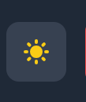
_Navigation bar highlighting the light mode icon_

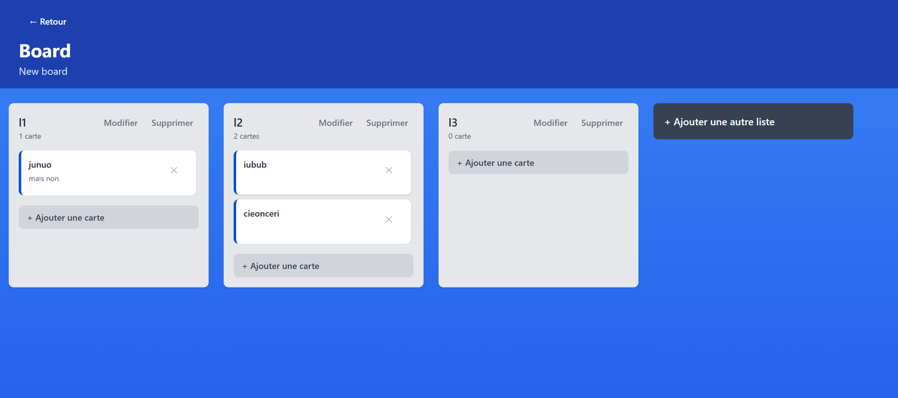
_Full board view in light mode showing the light theme_

---

### 📊 Activity Log

Planit tracks all actions performed in your workspace, boards, lists, and cards, providing a complete audit trail of changes.

#### Accessing the Activity Log

1. Open any **Board**
2. In the board header (top-right), click the **"📊 Activity"** button
3. A drawer will slide in from the right showing recent activities
4. Click the **×** button or the overlay to close the drawer

#### What Gets Tracked

The activity log captures:

**Workspace Actions:**
- Workspace created, updated, deleted

**Board Actions:**
- Board created, updated, deleted

**List Actions:**
- List created, updated, moved, deleted

**Card Actions:**
- Card created, updated, deleted
- Card moved between lists
- Card moved within the same list (reordered)
- Member assigned to card
- Member unassigned from card
- Card status changed (archived/active)
- Label added/removed

**Comment Actions:**
- Comment added to card
- Comment deleted

#### Understanding Activity Messages

Each activity entry shows:
- **Icon** indicating the action type (create, update, delete, move, assign, comment)
- **Message** describing what happened (e.g., "John Doe moved card 'Task 1' from 'To Do' to 'In Progress'")
- **Timestamp** showing when the action occurred (e.g., "5 minutes ago", "2 hours ago", "3 days ago")

#### Activity Feed Details

- Shows up to **50 most recent activities** per board
- Activities are sorted by **newest first**
- Each message is **internationalized** (displayed in your selected language: EN/FR)
- Activities include **user information** (who performed the action)
- **Detailed context** for complex actions (e.g., which list a card was moved from/to)

#### Use Cases

**Project Management:**
- Track when tasks were created and moved through stages
- See who made changes to important cards
- Monitor team activity and progress

**Audit & Compliance:**
- Complete history of all changes
- Identify when critical updates occurred
- Review who deleted or archived items

**Collaboration:**
- Stay informed about team member actions
- Understand the context of current board state
- Coordinate work based on recent changes

#### Technical Details

- Activities are **permanently stored** in the database
- The activity feed is **read-only** (activities cannot be edited or deleted)
- Old activities remain accessible through pagination (future enhancement)
- Each activity is linked to the specific workspace, board, and/or card

---

### 📱 Responsive Design

Planit is fully responsive and works seamlessly on:

- 💻 **Desktop** (recommended for best experience)
- 📱 **Tablets** (iPad, Android tablets)
- 📱 **Mobile devices** (smartphones)

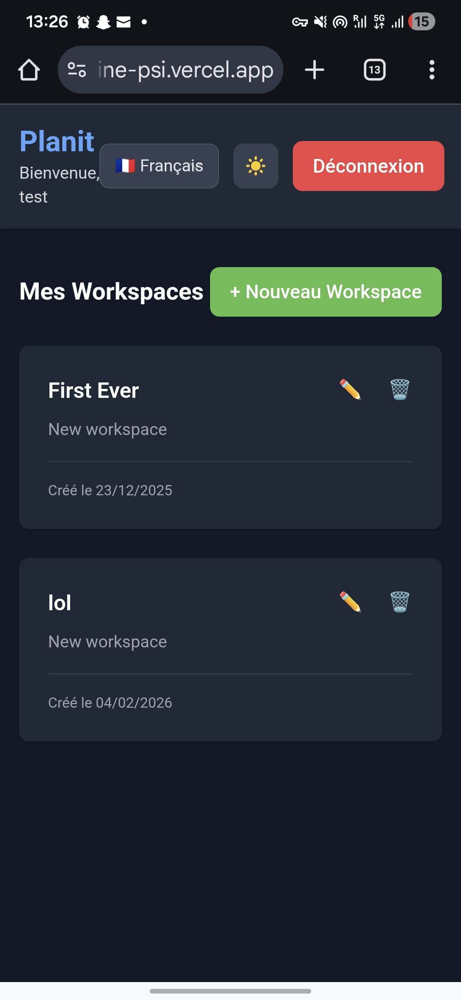
_Board view on mobile device (responsive mode)_

---

## ❓ FAQ & Troubleshooting

### General Questions

#### Q: Is Planit free to use?

**A:** Yes, Planit is a free, open-source project developed for educational purposes.

#### Q: Can I collaborate with team members?

**A:** Yes! You can invite team members to your workspace. Use the "Invite Members" feature in the Workspace view to add collaborators with Owner or Member roles.

#### Q: Is my data secure?

**A:** Yes. Your password is encrypted using bcrypt hashing, and all API communication uses JWT (JSON Web Tokens) for authentication. The application is served over HTTPS.

#### Q: Can I export my boards?

**A:** Export functionality is not available in v1.0 but is planned for future updates.

---

### Technical Issues

#### Q: My drag & drop positions are not saving

**A:** This issue has been resolved in the current version. If you experience this:

1. Ensure you're using the latest version (refresh the page with Ctrl+Shift+R or Cmd+Shift+R)
2. Check your internet connection
3. Contact support if the issue persists

#### Q: I forgot my password

**A:** Password reset functionality is not yet implemented. Please create a new account or contact the administrator.

#### Q: The page is loading slowly

**A:** The backend is hosted on Render's free tier, which may experience cold starts. The first request after inactivity may take 30-60 seconds. Subsequent requests will be fast.

#### Q: I see an error "Invalid token" or "Unauthorized"

**A:** Your session has expired (JWT tokens last 7 days). Please log out and log in again.

---

### Browser Compatibility

Planit works best on modern browsers:

- ✅ **Google Chrome** (recommended)
- ✅ **Mozilla Firefox**
- ✅ **Microsoft Edge**
- ✅ **Safari** (macOS/iOS)
- ⚠️ **Internet Explorer** is NOT supported

---

### Data Persistence

- **Workspaces, Boards, Lists, and Cards** are stored in MongoDB Atlas (cloud database)
- **Drag & drop positions** are persisted automatically
- **Language preference** and **Dark mode** settings are saved in browser localStorage
- **Login sessions** last for 7 days (JWT expiration)

---

## 🔗 Useful Links

- **Live Application**: [https://planit-nine-psi.vercel.app](https://planit-nine-psi.vercel.app)
- **API Documentation**: [https://planit-3fms.onrender.com/api-docs](https://planit-3fms.onrender.com/api-docs) (Swagger UI)
- **GitHub Repository**: [https://github.com/itsmardochee/Planit](https://github.com/itsmardochee/Planit)
- **Report Issues**: [GitHub Issues](https://github.com/itsmardochee/Planit/issues)

---

## 📞 Support

For questions, bug reports, or feature requests:

- Open an issue on [GitHub](https://github.com/itsmardochee/Planit/issues)
- Contact the development team:
  - Mardochée (Backend & DevOps)
  - Fred (Frontend & UI/UX)

---

## 🎯 Quick Start Checklist

- [ ] Create an account and log in
- [ ] Create your first workspace
- [ ] Create a board within the workspace
- [ ] Add lists (e.g., "To Do", "In Progress", "Done")
- [ ] Create cards in your lists
- [ ] Try drag & drop to move cards and lists
- [ ] Experiment with language switching (EN/FR)
- [ ] Toggle dark mode on/off
- [ ] Explore the application on mobile/tablet

---

**🎉 You're all set! Start organizing your projects with Planit!**

---

_This guide was last updated for Planit v1.0 (February 2026). Features may change in future versions._
